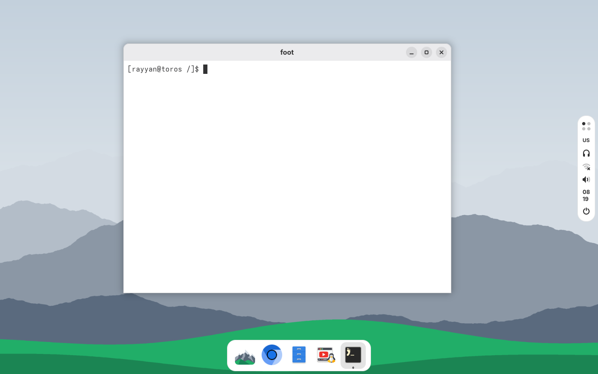
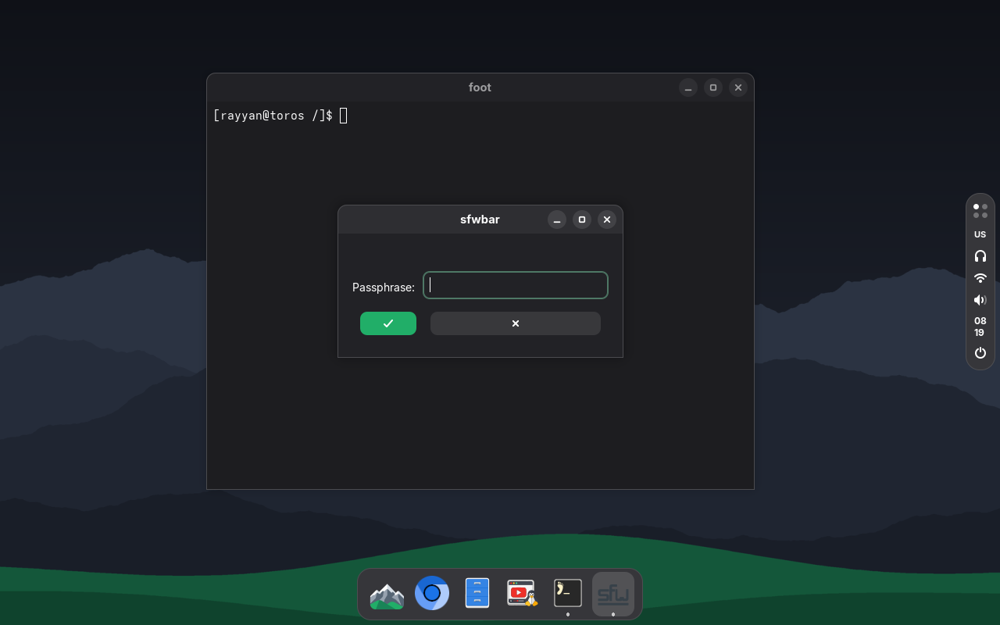

<p align="center"></p>

# torOS

A small Linux system built for one laptop: a Lenovo IdeaPad 1i 14IGL7
(Celeron N4020, 4 GB RAM, 64 GB eMMC). It is based on Void Linux, boots a
custom kernel with no initramfs straight into a Wayland desktop, and is rebuilt
as a whole disk image on a desktop PC and sent to the laptop over Wi-Fi.

This is a personal learning project, not a distribution. It only runs
properly on that laptop model, and it is published so the build can be read.

| Light | Dark | Boot splash |
|---|---|---|
|  |  |  |

(Screenshots are from the QEMU test VM.)

## Measured on the laptop

| | Result | Target |
|---|---|---|
| Kernel start to usable desktop (internal eMMC) | 5.2 s | 6 s |
| Idle RAM with desktop, panel, audio, Bluetooth, Wi-Fi | 162 MB | 150 MB (not met) |
| GTK4 app start (Text Editor), first after boot / later | 0.56 s / 0.44 s | 1.5 s / 0.5 s |
| Browser start (Thorium), first after boot / later | 2.3 s / 1.5 s | none set |

Started from a USB stick, the same laptop took 13 s with Void's stock kernel
and 7.9 s with this one. The
logs behind these numbers are in [hardware/](hardware/); device addresses in
them have been replaced with made-up ones.

## What is in it

- **Image build in a container.** [build.sh](build.sh) runs
  [build/in-container.sh](build/in-container.sh) in a rootless podman
  container: it installs the packages in [packages.txt](packages.txt) with
  `xbps-install`, lays [rootfs/](rootfs/) over them, compiles the few programs
  Void does not package, and writes a GPT disk image (ESP + ext4). Everything
  downloaded from outside Void's repositories is pinned by version and SHA-256.
- **Custom kernel, no initramfs.** [build/kernel.sh](build/kernel.sh) starts
  from Void's config, keeps only the modules the laptop loads
  (`localmodconfig` with [kernel/lsmod-laptop.txt](kernel/lsmod-laptop.txt)),
  then applies [kernel/fragment](kernel/fragment): storage, file system and
  display drivers built in, the command line built in, firmware for the GPU
  and CPU embedded. The build fails if a line of the fragment does not survive.
  Void's kernel stays on the disk as a recovery boot entry.
- **Boot splash without Plymouth.** The logo is shown by the boot loader's
  stub, then by the kernel in the same place, then kept by a 250-line C program
  ([build/splash.c](build/splash.c)) that the kernel runs as its first process
  before it hands over to runit.
- **A one-second black screen, found and removed.** The compositor's first mode
  set switched the panel off and on because of one connector property;
  [build/patches/kernel-edp-max-bpc.patch](build/patches/kernel-edp-max-bpc.patch)
  brings it from 1.1 s down to about 20 ms.
- **Two upstream bugs patched.** iwd crashed in a loop on the MT7921 Wi-Fi chip
  (a null pointer in its signal polling), and the sfwbar panel sometimes never
  appeared because of a use-after-free between two threads. Both fixes are in
  [build/patches/](build/patches/).
- **Desktop.** labwc, sfwbar (patched into a dock and a status strip), fuzzel,
  foot and mako, all coloured from one palette file so that they match
  libadwaita apps in light and dark.
- **An overview on the Super key, after GNOME's.** `Super` (or the dock's
  logo) opens a sheet where the windows are: the open windows as small live
  pictures (labwc can hand out the picture of a single window), under them the
  applications, and a search field that is typed into at once. Enter opens the
  first match, the arrow keys go to another, a window's picture brings it to
  the front or closes it. It is a third small GTK4 program in Rust
  ([overview/](overview/)) that starts when asked and ends when something was
  chosen. The key acts when it is let go and only if nothing else was pressed
  meanwhile, so `Super` held for a second and then `Space` just changes the
  keyboard layout.
- **Keyboard layout with a flag.** `Super+Space` or `Alt+Shift` goes to the
  other layout and the status panel shows its flag
  ([rootfs/usr/share/toros/flags/](rootfs/usr/share/toros/flags/)). A panel
  is not told when the keyboard changes layout by itself, so
  [toros-layout](rootfs/usr/bin/toros-layout) changes it instead: it puts the
  other layout first in the keyboard's list and has labwc read it again.
- **Hold to power off.** In the session menu, power off, restart, log out and
  suspend have to be held for two seconds; the row fills up meanwhile and
  empties when it is let go early. sfwbar is patched for that
  ([build/patches/sfwbar-hold.patch](build/patches/sfwbar-hold.patch)).
- **Emoji picker and clipboard history.** `Super+.` opens a small GTK4 window
  written in Rust ([picker/](picker/)) with the emoji of Apple Color Emoji:
  search in English or Turkish, groups, skin tones, recently used. The chosen
  emoji is pasted into the window that was in use (it cannot be typed:
  Chromium drops key presses for characters beyond U+FFFF), and the clipboard
  gets back what it held. `Super+V` opens the same window on what was copied
  before, text and pictures, and pastes the chosen item. The window starts when asked and ends after pasting; only a watcher of
  under a megabyte (`toros-clipd`, no GTK) keeps running, and the history lives
  in memory, so it is gone after a restart.
- **Screenshots and recordings, the Windows way.** `Print` or `Super+Shift+S`
  freezes the screen with a small bar at the top; an area dragged out of it
  (a rectangle or any shape drawn by hand, or the whole screen) is on the
  clipboard and in `Pictures/Screenshots` at once, and a click on the
  notification opens it in an editor with a highlighter, a pen and an eraser,
  whose changes replace the file and the clipboard by themselves.
  `Super+Shift+R` records: the area can still be moved and resized, "Start"
  counts down from three, and `wf-recorder` films it with the laptop's sound
  into `Videos/Recordings` until it is stopped or thrown away; a highlighter
  draws on the live screen meanwhile. It is one more GTK4 program in Rust
  ([shot/](shot/)) that runs only while it is in use.
- **A keyboard on the screen, after Apple's.** `Super+Ctrl+O` (or the
  keyboard button on the status panel, or "On-screen keyboard" in the
  overview) shows the iPhone's keyboard as a small floating panel, light or
  dark as the desktop is, for typing with the touchpad: a click on a key types into the window that has the keys, through the
  compositor's virtual keyboard. It shows the letters of the layout in use
  (English or Turkish) and Apple's two pages of digits and signs. Dragged,
  thrown or swiped with two fingers over the left or right edge of the screen
  it slides out and leaves a tab with an arrow there, as a video on an iPhone
  does; a click on the tab brings it back. Rust, GTK4 and libadwaita
  ([keyboard/](keyboard/)).
- **A lock screen in GTK, and locked before it sleeps.** `Super+L` (or "Lock"
  in the panel's menus) shows the wallpaper with the time and the date, as
  Windows and GNOME do; a key or a click brings the account's name and a
  password field, and the letter that was typed is already in it. PAM checks
  the password. The corner has the battery, the keyboard layout's flag,
  which a click, `Super+Space` or `Alt+Shift` changes there too, and a button
  for a keyboard to click on: the lock screen has those keys itself (the same
  rows and icons), since a locked screen shows no other program. It is a
  small GTK4 program in Rust ([lock/](lock/)) on the compositor's session
  lock, drawn in software, that runs only while the screen is locked; a
  watcher starts it again if it ever dies, because the compositor keeps a
  screen locked whose lock screen is gone. Closing the lid or "Suspend" locks
  first: `zzz` runs
  [a hook](rootfs/etc/zzz.d/suspend/10-toros-lock) that waits until the lock
  screen is drawn, so the desktop is not what shows when the laptop wakes up.
- **Low-battery warning.** The panel reads the battery anyway, so it also
  warns: a notification at 15 % and one that stays at 5 %
  ([battery-warn](rootfs/usr/lib/toros/battery-warn)), both gone again when
  the charger is plugged in. No extra program runs for it.
- **Hearing aid support.** A Phonak hearing aid connects over Bluetooth
  Classic with one click or `Super+B`, and sound follows it
  ([rootfs/usr/bin/toros-bt](rootfs/usr/bin/toros-bt)).
- **Updates over Wi-Fi.** [push.sh](push.sh) finds the laptop on the local
  network by its SSH host key, rsyncs the new build onto the running system
  and reboots it. It can also take screenshots and run commands there.
- **Tests in QEMU.** [test/qemu.sh](test/qemu.sh) boots the image under UEFI
  and runs a self-test that reports over the serial port;
  [test/vm.py](test/vm.py) drives the VM by hand and can film the boot.

## Layout

```
build.sh, build/      image build (container), kernel build, splash, patches
packages.txt          Void packages in the image
rootfs/               files laid over the image (/etc, /usr)
overview/             windows, applications and search on the Super key (Rust, GTK4)
keyboard/             on-screen keyboard for the pointer (Rust, GTK4, libadwaita)
lock/                 lock screen (Rust, GTK4)
picker/               emoji picker and clipboard history (Rust, GTK4)
shot/                 screenshots and screen recordings (Rust, GTK4)
kernel/               kernel options, the laptop's module list, boot logo
imports/zapret/       zapret source (see below) and its configuration
hardware/             logs and hardware facts collected from the laptop
test/                 QEMU test scripts
push.sh               send a build to the laptop over Wi-Fi
write-usb.sh          write the image to a USB stick
install.sh            install from the stick onto the laptop's internal disk
```

## Building

Needs Linux with rootless podman, and QEMU with OVMF for the tests.

```bash
./build.sh
```

```bash
test/qemu.sh selftest
```

Things to know before trying:

- The build also compiles Oynaz, a separate YouTube client of mine that is not
  published yet, and stops if its source is not at `~/Projects/oynaz` (or
  `OYNAZ_SRC`).
- `build.sh` creates SSH keys in `keys/` and builds them into the image, and
  the image has a fixed first password. Both are fine for a laptop on a home
  network that only its owner updates, and wrong for anything else.
- The kernel and several programs are compiled for the laptop's CPU family
  (`-march=goldmont-plus`) and the kernel only has this laptop's drivers.
- The hearing aid's address is read from `local/hearing-aid` on the build PC,
  which is not in the repository.

## Known gaps

Idle RAM is above the target. Suspend and resume, hardware video decoding in
the browser and screen sharing have not been checked on the custom kernel, and
the hearing aid does not yet reconnect by itself after being switched off and
on. There is no first-run setup and no update path other than `push.sh`.

## Credits and licences

torOS is put together from other people's work:
[Void Linux](https://voidlinux.org/), the Linux kernel,
[labwc](https://github.com/labwc/labwc),
[sfwbar](https://github.com/LBCrion/sfwbar), iwd, PipeWire, BlueZ, grim,
[wf-recorder](https://github.com/ammen99/wf-recorder),
[adw-gtk3](https://github.com/lassekongo83/adw-gtk3),
[Thorium](https://github.com/Alex313031/thorium) and
[zapret-gtk](https://github.com/Taygun86/zapret-gtk) and the Apple Color Emoji
font as built for Linux by
[apple-emoji-ttf](https://github.com/samuelngs/apple-emoji-ttf). None of these
are in the repository; the build downloads them. The emoji pictures are Apple's
and are not mine to pass on: an image built from this repository is for its
builder's own use.

[picker/data/emoji.txt](picker/data/emoji.txt) is made from Unicode's emoji
list and CLDR's annotations (© Unicode, Inc., under the
[Unicode License](https://www.unicode.org/license.txt)).

[imports/zapret/](imports/zapret/) is a copy of
[bol-van/zapret](https://github.com/bol-van/zapret) at commit `87e0586`, under
its own MIT licence ([imports/zapret/docs/LICENSE.txt](imports/zapret/docs/LICENSE.txt)),
with my configuration added.

The files in [build/patches/](build/patches/) change the Linux kernel (GPL-2.0),
iwd (LGPL-2.1), sfwbar (GPL-3.0) and mako (MIT) and fall under those licences. Everything
else here is under the [MIT licence](LICENSE).

The project was built with a lot of help from Claude Code.
